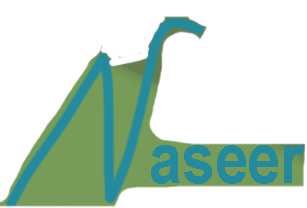

  
  

# Hi, I'm Naseer 

Welcome to my GitHub profile!  
I'm a young tech enthusiast and student, passionate about understanding the technology I use every day. My journey is driven by curiosity and a desire to build solutions for real-world problems.

  
  

##  About Me

- Student, self-learner, and experimenter
- 🛠️ Love building and tinkering with projects
- 💡 Always keen to discover how things work
- 😢 Always Thinking what  to Name The Variables

##  What I'm working on

- Exploring programming fundamentals in Python & C
- Building small projects and automations
- Documenting what I learn along the way

  <a href="https://skillicons.dev">
    <!-- Notice the change in the src below: -->
    
  </a>

##  Goals

- Deepen my understanding of computers and software
- Solve practical problems with code
- Connect and collaborate with fellow learners

##  Connect with me

- GitHub: [Naseer-fez](https://github.com/Naseer-fez)

---

Happy coding! 🚀
